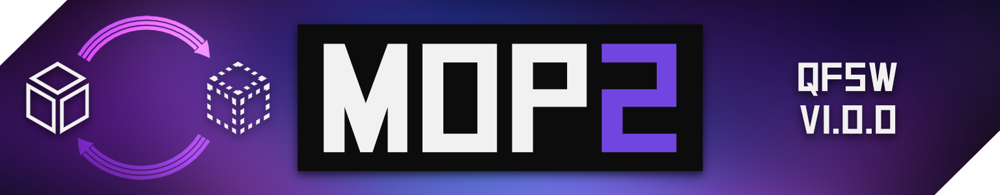

<p align="center">
  
</p>
<p align="center">
  
  
  <a href="https://openupm.com/packages/com.qfsw.mop2/"></a>
</p>

Master Object Pooler 2 is a high performance, flexible and easy to use object pooling solution that can fit into any Unity project.

[Full Documentation and API Reference](https://www.qfsw.co.uk/docs/MOP2)

[Unity Asset Store](https://assetstore.unity.com/packages/tools/utilities/master-object-pooler-2-146525)

### Getting Started

In order to get started, create an `ObjectPool` for your desired object.

- Use `Create -> Master Object Pooler 2 -> Object Pool` to create it at edit time
- Use `ObjectPool.CreateInstance()` to create one at runtime

Once you have an `ObjectPool`, use `pool.GetObject()` and `pool.Release()` in place of all `Instantiate` and `Destroy` calls. This means objects will be recycled through the pool, reducing GC and greatly improving efficiency.

Using a `MasterObjectPooler` can greatly ease the use of managing multiple pools. Pools can be added to it either in the inspector, or at runtime with `AddPool`. Once added to the pool, you can use all of the normal pool functions (or retrieve the pool) with a string reference.

### Extras

`AutoPool` is a script that can be added to any object to make it automatically pool itself after a surpassed amount of time. The parent pool is injected to the pool via the `IPoolable` component, so you do not need to do it yourself

You can make your own scripts that use the parent pool by implementing `IPoolable`

Any script deriving from or using `PoolableMonoBehaviour` will have a new `Release` method, allowing you to release the object without needing a reference to its pool

MOP2 also provides `GetObjectComponent<T>`, a GC free method of getting the object component. This should be used whenever possible to improve efficiency.

### Installing via Package Manager
#### 2019.3+
Starting with Unity 2019.3, the package manager UI has support for git packages

Click the `+` to add a new git package and add `https://github.com/QFSW/MasterObjectPooler2.git` as the source

#### 2018.3 - 2019.2
To install via package manager, add the file `Packages/manifest.json` and add the following line to the `"dependencies"`
```
"com.qfsw.mop2": "https://github.com/QFSW/MasterObjectPooler2.git"
```
Your file should end up like this
```
{
  "dependencies": {
    "com.qfsw.mop2": "https://github.com/QFSW/MasterObjectPooler2.git",
    ...
  },
}
```

#### Install via OpenUPM
The package is available on the [openupm registry](https://openupm.com). It's recommended to install it via [openupm-cli](https://github.com/openupm/openupm-cli).

```
openupm add com.qfsw.mop2
```

Thanks to [`caprapaul`](https://github.com/caprapaul) for logo work.
